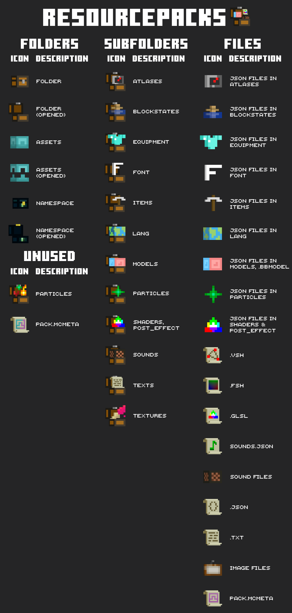
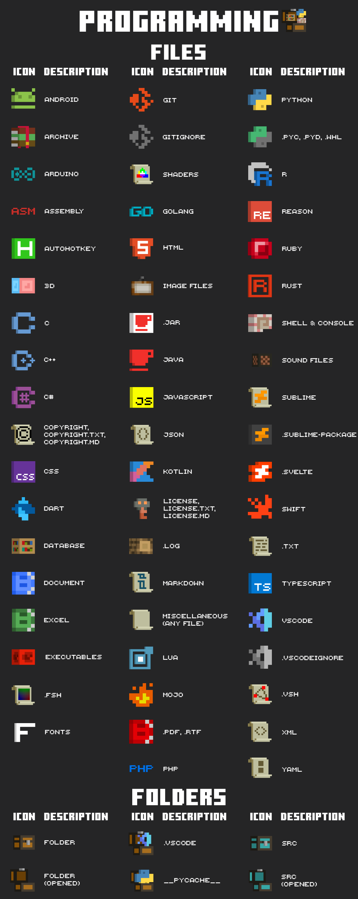
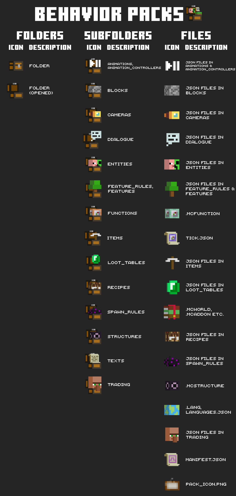
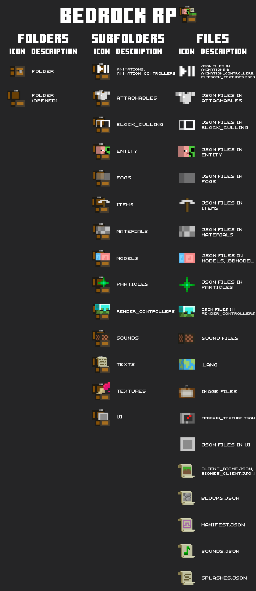
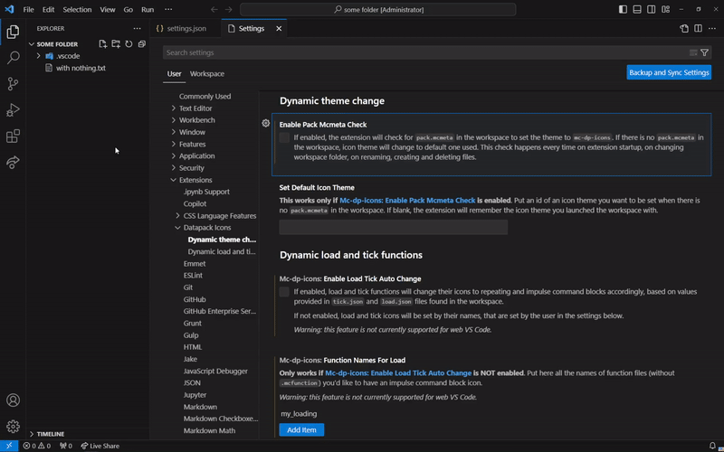
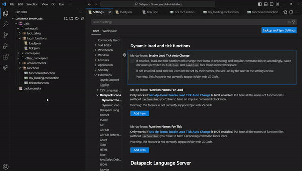
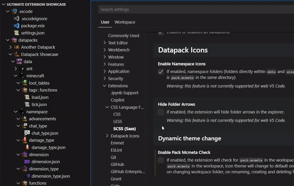
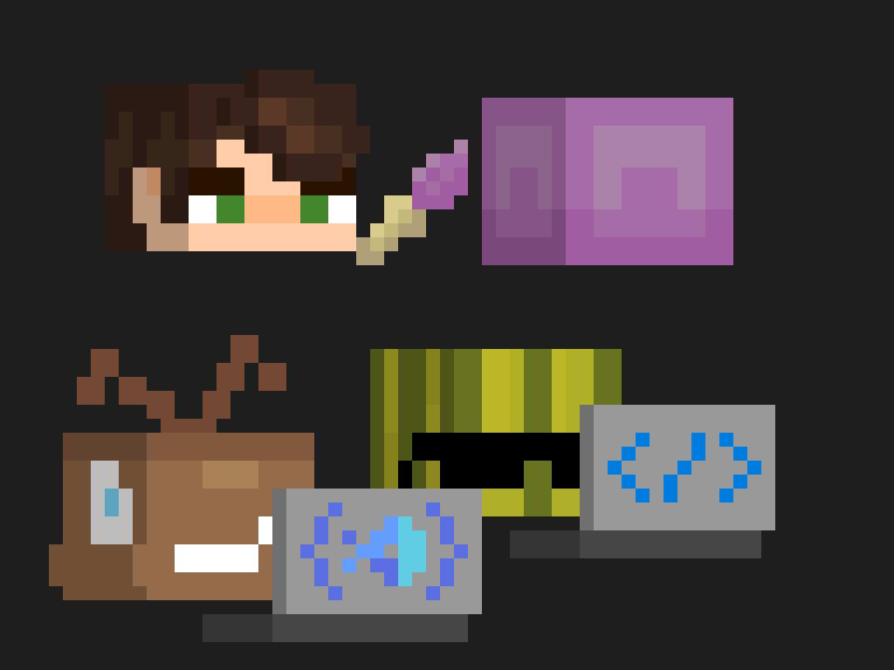

---
Datapack Icons is a fancy, minecraft-styled icon theme designed specifically for datapack and resourcepack devs. Looking through [Microsoft's behavior packs documentation](https://learn.microsoft.com/en-us/minecraft/creator/documents/behaviorpack#building-the-behavior-pack), we took inspiration from those icons and decided to implement them in VS Code. 

## 3.0 Trailer
Made by SuperAnt_: https://www.youtube.com/watch?v=eYAvg19stpU

<h2>Icons</h2>

<h2>Dynamic Icons features</h2>

### Namespace Icons
Namespace icons are no longer unused! The extension will find any folders directly within `data` and `assets` folders and assign an ender chest icon to the names of these folders, but only if there's `pack.mcmeta` in the same directory. That also means that if there will be a folder in any location with the same name as one of the namespace folders in the same workspace, that folder will also recieve ender chest icon, so this feature can be turned off in the settings.

### pack.mcmeta detect
 Extension will look for `pack.mcmeta` in the workspace, and if it finds it, changes the icon theme from current to dp-icons. If not, the theme will change to a default one - either it will be the theme workspace was launched with, or defined in the settings.

### Icons for `load` and `tick` functions
`tick` and `load` functions icons will change their icons to repeating and impulse command blocks accordingly, based on the values provided in `tick.json` and `load.json` files found in the workspace. This feature can be toggled to assign the icons not by the `tick.json` and `load.json` files, but by the functions names, which can be specified in the settings.

### Hide folder arrows
If you don't like these arrows near the folder icons, you can hide them by enabling this setting!

<h2>Why did we choose *this* icon for *that*?</h2>

### Datapacks
- Chest can contain things, such as `folder`
- Shulker represents that `data`pack can be carried between the worlds
- Advancement icon for `advancements`
- **Chat** bubble for `chat_type`
- Sword can deal damage that is associated with red color, that's why it's for `damage_type`
- You can go in the nether portal to go to the other `dimension`
- End portal and nether portal lead to different dimensions, so they represent `dimension_type`
- `functions` contain commands, such as command blocks
- An iconic item, such as a diamond pickaxe, can represent `item_modifiers`
- You can get some valuable **loot** from `loot_tables`, such as an emerald
- Observer checks things, `predicates` can also check for something
- We use `recipes` in the crafting table
- Name **tag** can represent `tags`
- diamond armor with a redstone trim is for `trim_material`
- diamond armor with a neutral color trim is for `trim_pattern`
- When we think of a minecraft world, we usually think of lots of grass blocks, so it represents `worldgen`
- `tick functions` run every tick, as well as repeating command blocks
- Next to repeating command blocks, we usually put chain command blocks, such as `normal functions` that are usually run by tick functions
- Impulse command block runs the command only one time after we activate it, like a `load function`, which we activate with /reload
- **Structure** block represents `structure files`
- Curly brackets are basically essential in `.json` files
- Lines of text represent `.txt`
- `pack.mcmeta` is used like a document for datapacks and resourcepacks to be used by minecraft, so it has shulker icon on it
- Ender chest is like a space storage, so it can represent the `namespace`
### Resourcepacks
- Cyan shulker represents `assets` the same way as the `data` icon, the color is cyan because of [this](https://learn.microsoft.com/en-us/minecraft/creator/documents/resourcepack#building-the-resource-pack)
- `atlases` are associated with maps that are associated with compasses
- Waterlogged fence shows a lot of `blockstates`
- Letter **F** for `font`
- Planet can represent lots of `lang`uages
- Blockbench default cube is a start of `models`
- Happy villager particle for `particles`
- RGB triangle is often a beginner task for `shaders`, `.glsl` devs
- Note block makes `sounds` that in resourcepacks and other places can be `.ogg` or `.mp3` files
- There are some `texts` on the paper!
- Brushes draw the `textures`
- Painting contains an image, as well as `.png` and other image file formats
- Note on a paper represents `sounds.json` as some sort of sound configuration file
- Highlighted vertices on a triangle represent `Vertex SHader` files
- RGB pixel represents `Fragment SHader` files
### Behaviorpacks
- "Play/pause" button is associated with `animations` or videos
- Spyglass is probably the closest thing to `cameras` in minecraft
- There are a lot of `features` in the game, tree is one of them
- Most of the mobs spawn from eggs and a dragon egg is the most iconic, so it represents `spawn_rules`
### Bedrock Resourcepacks
- Armor can be an `attachable`
- A hollow block represents `block_culling`
- Transparent texture can be a `material`
- `render_controllers` determine what renders on an entity, so hemlet on a zombie's head represents it
- A slot is in the player's inventory, so it represents `ui`
### Programming
Most of the programming icons don't need an explanation, but there are a few exceptions:
- We write something on paper scrolls, as well as in `most of the file formats`
- `Markdown` files usually contain some information, and letter **i** usually represents info
- Key, that can lock something valuable, represents `LICENSE` files
- `database` files can be represented by a bookshelf because it contains a lot of information
- Redstone block activates things, like an `executable`
- oak `log` :​P
- Nautilus `shell` for shell and console files
- Warped chest for `src` folder because it's the closest color to green

---
## Creators
We are [FuncFusion](https://github.com/FuncFusion) - a small team of three:

[SuperAnt_](## "super.ant_ on discord") - Came up with the initial idea, made the extension

[bth123](https://github.com/bth123) - Made all the icons and illustrations, also made a [sublime port](https://github.com/bth123/mc-dp-icons-sublime) of this extension

[amandin](https://github.com/amawdiin) - Coded most of the dynamic icons features, included this extension in his [amazing extension collection](https://marketplace.visualstudio.com/items?itemName=amandin.dpc-pack)

**Enjoy!**
